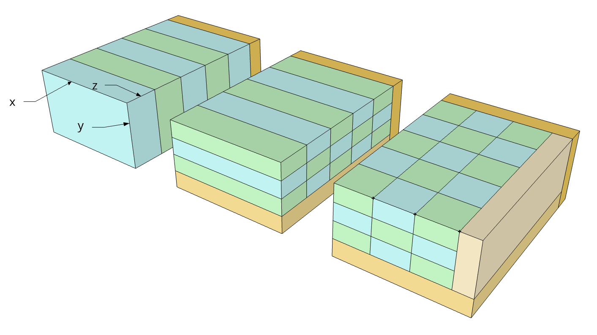

```{r  ring light-run data, include=FALSE,eval=FALSE}
setwd("~/Pubblici/learn-git/ring/ring-light-run")
mat <- array(data = 0, dim = c(96,4))
colnames(mat) <- c('node','numproc','exec-time','init-time')
row <- 1
for (i in 1:4){
  for (j in 1:24){
    num <- i*j
    tab <- read.csv(paste("./ring-node-",i,"-core-",num,"/summary.csv", sep = ''))
    mat[row, 1] <- i
    mat[row, 2] <- num
    mat[row, 3] <- mean(tab[,2])
    mat[row, 4] <- mean(tab[,3])
    row <- row + 1
  }
}
mat <- data.frame(mat)
mat$node <- as.factor(mat$node)
```
```{r ring light-run plot,echo=FALSE,eval=FALSE}
library(ggplot2)
block_start <- 1 + 24 * 0
block_end <- 24 * 4
ggplot(data = mat[block_start:block_end,],mapping = aes(x = numproc, y = exec.time, color = node)) +
  geom_line()+
  geom_point()+
  labs(title = "Light  run ring",
       caption = "1'000 for all combination of  nodes")
```
```{r ring heavy-run data, include=FALSE,eval=FALSE}
setwd("~/Pubblici/learn-git/ring/nested-file-bash")
mat <- array(data = 0, dim = c(96,4))
colnames(mat) <- c('node','numproc','exec-time','init-time')
row <- 1
for (i in 1:4){
  for (j in 1:24){
    num <- i*j
    tab <- read.csv(paste("./ring-node-",i,"-core-",num,"/summary.csv", sep = ''))
    mat[row, 1] <- i
    mat[row, 2] <- num
    mat[row, 3] <- mean(tab[,2])
    mat[row, 4] <- mean(tab[,3])
    row <- row + 1
  }
}
mat <- data.frame(mat)
mat$node <- as.factor(mat$node)
```
```{r ring heavy-run plot, include=FALSE, eval=FALSE}
library(ggplot2)
block_start <- 1 + 24 * 0
block_end <- 24 * 4
ggplot(data = mat[block_start:block_end,],mapping = aes(x = numproc, y = exec.time, color = node)) +
  geom_point()+
  labs(title = "Heavy  run ring",
       caption = "10'000 repetions for the 1, 2 and 3 nodes, 1'000 for 4 nodes")
```

```{r pingpong no-flags, include=FALSE}
library(ggplot2)
topol <- c('core', 'socket', 'node')

ping.mpi <- array(data = 0, dim = c(90,6))
colnames(ping.mpi) <- c("topol","bytes","time","Mb.s","time.comp","Mbs.comp" )
parameterEstimation <- array( data = 0, dim = c(1,6))
colnames(parameterEstimation) <- c("core.latency", "core.bandwidth",
                                   "socket.latency","socket.bandwidth",
                                   "node.latency", "node.bandwidth")
parameterEstimation <- data.frame(parameterEstimation)
how.row <- 1

howmany <- 100 
iter <- howmany -1
for  ( to in topol ){
  setwd(paste("~/Pubblici/learn-git/noflag-pingpong/data_col_mpi_noflag/topo-"
              ,to,sep=''))
  mat <- array(data = 0, dim = c(howmany,30,2))
  y.dat <- c()
  x.dat <- c()
  z.dat <- c()
  y.modelLatency <- c()
  x.modelLatency <-c()
  y.modelBandwidth <- c()
  x.modelBandwidth <- c()
  for (y in 0:iter){
    tab <- read.csv(paste('results-',y,'.csv', sep = ''))
    mat[y+1,,1] <- tab[,3]
    mat[y+1,,2] <- tab[,4]
    y.dat <- c(y.dat, tab[,3])
    x.dat <- c(x.dat, tab[,1])
    y.modelLatency <- c(y.modelLatency, tab[1:16,3])
    x.modelLatency <- c(x.modelLatency, tab[1:16,1])
    y.modelBandwidth <- c(y.modelBandwidth, tab[27:30,3])
    x.modelBandwidth <- c(x.modelBandwidth, tab[27:30,1])
    z.dat <- c(z.dat, tab[,4])
  }
  modelLatency <- nls(y.modelLatency ~ a + x.modelLatency/b, start = list(a=0.5, b = 6000))
  modelBandwidth <- nls(y.modelBandwidth~ a + x.modelBandwidth/b, start = list (a=2, b = 12000))
  
  latency <- coef(modelLatency)[1]
  bandwidth <- coef(modelBandwidth)[2]
  
  parameterEstimation[1,paste(to,".latency",sep='')] <- latency
  parameterEstimation[1,paste(to,".bandwidth",sep='')] <- bandwidth
  
  mat.mean <- matrix(data = 0, nrow = 30, ncol = 2)
  mat.var <- matrix(data = 0, nrow = 30, ncol = 2)
  for (y in 1:30){
    mat.mean[y,1] <- mean(mat[,y,1])
    mat.mean[y,2] <- mean(mat[,y,2])
    mat.var[y,1] <- var(mat[,y,1])
    mat.var[y,2] <- var(mat[,y,2])
    tab[y,5] <- latency + tab[y,1]/bandwidth
    tab[y,6] <- tab[y,1]/tab[y,5]
    
    ping.mpi[how.row, 1] <- to
    ping.mpi[how.row, 2] <- tab[y,1] # number of bytes
    ping.mpi[how.row, 3] <- tab[y,3] # mean time
    ping.mpi[how.row, 4] <- tab[y,4] # Mb per second
    ping.mpi[how.row, 5] <- tab[y,5] # computed time
    ping.mpi[how.row, 6] <- tab[y,6]
    how.row <- how.row + 1
  }
  tab[,3] <- mat.mean[,1]
  tab[,4] <- mat.mean[,2]
  
  write.csv2(round(tab,digits = 2), 
             file = paste('~/Pubblici/learn-git/data_col_mpi/summary--topo-',to,
                          '.csv',sep=''),
             quote = FALSE ,row.names = FALSE)
  
}
ping.mpi <- data.frame(ping.mpi)
ping.mpi$bytes <- as.numeric(ping.mpi$bytes)
ping.mpi$time <- as.numeric(ping.mpi$time)
ping.mpi$Mb.s <- as.numeric(ping.mpi$Mb.s)
ping.mpi$time.comp <- as.numeric(ping.mpi$time.comp)
ping.mpi$Mbs.comp <- as.numeric(ping.mpi$Mbs.comp)
```

```{r pingpong no-flags plot, echo=FALSE, eval=FALSE}
# ping.mpi[ping.mpi$bytes %in% c(0,1,2,4,8,16,32,64,128,256,512,1024,2048,4096,8192),]
ggplot(data = ping.mpi)+
  geom_point(mapping = aes(x = bytes, y = Mb.s, color = topol ))+
  geom_line(mapping = aes(x = bytes, y = Mbs.comp, color = topol ))+
  scale_x_continuous(trans='log2')
```


## Section 1 ##

### Double ring
Aside from the efficiency of the program, which was not compared with others, we can note two main facts regarding to the collected data:

* first of all the relation between the execution time and the number of processor is linear;
* and in the second place there are only two clearly different slopes.

We can explain the first note remembering that the only difference between execution with two number of processors is how many iteration are required for each processors to receive its original message. Increasing the *number of process* by one means increasing the *number of process through which the message has to pass* by one, and therefore means increasing the *number of iteration* to complete the loop by one.

The second observation is trivially explainable if we note that the main gap in the considered communication is the latency of the network: if the nodes are two, three or four the latency is always given by the Infiniband network, therefore the slopes of time execution of these three measurements are perfectly equal. We observe that in one-node scenario the latency is lower and so is the slope.

```{r ring really heavy-run data, echo=FALSE}
setwd("~/Pubblici/learn-git/ring/ring-heavy-run")
mat <- array(data = 0, dim = c(96,4))
colnames(mat) <- c('node','numproc','exec-time','init-time')
mod.ring <- array(data = 0, dim = c(96,3))
colnames(mod.ring) <- c('numproc','node','time')
row <- 1
for (i in 1:4){
  for (j in 1:24){
    num <- i*j
    tab <- read.csv(paste("./ring-node-",i,"-core-",num,"/summary.csv", sep = ''))
    mat[row, 1] <- i
    mat[row, 2] <- num
    mat[row, 3] <- mean(tab[,2])
    mat[row, 4] <- mean(tab[,3])
    mod.ring[row, 1] <- num
    mod.ring[row, 2] <- i
    if (i == 1){
      mod.ring[row, 3] <- 2*num*(parameterEstimation$core.latency/(10^6)+
                                 8/(parameterEstimation$core.bandwidth*2^20))
    }
    else {
      mod.ring[row, 3] <- 2*num*(parameterEstimation$node.latency/(10^6)+
                                 8/(parameterEstimation$node.bandwidth*2^20))
    }
    row <- row + 1
  }
}
mod.ring <- data.frame(mod.ring)
mod.ring$node <- as.factor(mod.ring$node)
mat <- data.frame(mat)
mat$node <- as.factor(mat$node)
```
```{r ring really heavy-run plot, echo=FALSE, out.width='80%', fig.align='center'}
library(ggplot2)
block_start <- 1 + 24 * 0
block_end <- 24 * 4
ggplot(data = mat[block_start:block_end,],mapping = aes(x = numproc, y = exec.time, color = node)) +
  geom_point()+
 # scale_y_continuous(trans='log10')+
  #geom_line(data = mod.ring[block_start:block_end,],mapping = aes(x = numproc, y = time, color = node))+
  labs(title = "Double ring",
       caption = "mean of 10 run with 100'000 repetions of one ring-round per run")
```

### Matrix

In this subsection we can observe some obvious facts about a program that implements a domain decomposition but does not make any communication between the processes during the computation: indeed the matrix addition do not require communication aside the ones used to decompose the domain.

We start explaining how such decomposition is implemented. Given a matrix of $N_x\times N_y \times N_z$ dimensions, we considered that it is stored in memory such that the distance in memory between two elements $(x_0,y_0,z_0)$ and $(x_1,y_1,z_1)$ is $|x_0-x_1| + N_x *|y_0-y_1| + N_x*N_y*|z_0-z_1|$. Due to this idea the best one dimensional split is on the $z$ dimension and the two dimensional split is the one on the $z$ and $y$ dimensions. In case the dimension is not a multiple of the processes assigned to that direction, a round robin distribution is executed. The figure is quite explanatory. Indeed, these types of decomposition allow to send neighboring elements in memory to the same process, reducing the number of jump in memory during the communication. 

```{r pressure, echo=FALSE, fig.cap="Scheme of 1,2 and 3 D decompositions. The orange parts are the remaining ones of the matrix when the dimension in not a multiple of the process assigned to that direction.", out.width='80%', fig.align='center'}

```

The collected data confirm this claim regarding the efficient splits. The grid of processes will be represented using the numbers of assigned process to the considered dimension: $3-4-2$ is a grid of processes where $3$ is the number of split the matrix is divided into along $x$ dimension. We write an $x$ in any place to indicate any possible number, for example: $x-1-x$ represents all the splits in which the $y$ dimension is not subdivided. It is important to remember that in this case the number of total processes is kept constant and so is the product of the three grid numbers. This particular notation is used cause to the fact that every possible split was considered. The main consequence is that for $2D$ and $3D$ dimension decomposition the graph will present a box with mean (and variance) over all possible splits.

The main things to be noticed is the low performance of any splits that involves a decomposition along the $x$ dimension cause to the larger jumps in memory that this type of decomposition implies. In this case the size of the jump to be made to send a block of the matrix is (more or less) $N_x \times N_y$ and the worst choices are the $x-1-1$, $x-1-x$ and $x-x-1$. The decompositions over the $y$ dimension are more efficient than the previous because the size of the jump is circa $N_x$ but less robust than the ones over $z$ (compare $1-x-1$ and $1-1-x$).

Furthermore, for each split different matrix dimensions were tested. It can be observed, for example, that the first four matrices  (the ones with the larger $N_z$) are the ones with the worst performance due to the biggest jumps in memory done during the communication. 

Finally, a program that use a simple "scatter-gather" dynamic over the same number of processes is used as a baseline of the results (the **check** part of the graph). It is not a surprise that is far more efficient not only than the $2D$ and $3D$ decomposition (due to the absence of any jump) but also than the best $1D$ decomposition: indeed the **check** case has not the overhead given by the specific decomposition and the round-robin on the remaining part of the matrix.

```{r decomposition of processes in grid,include=FALSE}
D_vec <- array(data = 0, dim = c(30,3))
# 1D decomposition
D_vec[1,1]=24 ; D_vec[1,2]=1; D_vec[1,3]=1
# 2D decomposition
D_vec[2,1]=12; D_vec[2,2]=2; D_vec[2,3]=1
D_vec[3,1]=2; D_vec[3,2]=12; D_vec[3,3]=1
D_vec[4,1]=6; D_vec[4,2]=4; D_vec[4,3]=1
D_vec[5,1]=4; D_vec[5,2]=6; D_vec[5,3]=1
D_vec[6,1]=3; D_vec[6,2]=8; D_vec[6,3]=1
D_vec[7,1]=8; D_vec[7,2]=3; D_vec[7,3]=1
# 3D decomposition
D_vec[8,1]=2; D_vec[8,2]=2; D_vec[8,3]=6
D_vec[9,1]=2; D_vec[9,2]=6; D_vec[9,3]=2
D_vec[10,1]=6; D_vec[10,2]=2; D_vec[10,3]=2
D_vec[11,1]=4; D_vec[11,2]=2; D_vec[11,3]=3
D_vec[12,1]=4; D_vec[12,2]=3; D_vec[12,3]=2
D_vec[13,1]=2; D_vec[13,2]=4; D_vec[13,3]=3
D_vec[14,1]=2; D_vec[14,2]=3; D_vec[14,3]=4
D_vec[15,1]=3; D_vec[15,2]=4; D_vec[15,3]=2
D_vec[16,1]=3; D_vec[16,2]=2; D_vec[16,3]=4
# 1D decomposition, remaining subdivision
D_vec[17,1]=1 ; D_vec[17,2]=24; D_vec[17,3]=1
D_vec[18,1]=1 ; D_vec[18,2]=1; D_vec[18,3]=24
# 2D decomposition, remaining subdivision
D_vec[19,1]=1;  D_vec[19,2]=2;  D_vec[19,3]=12
D_vec[20,1]=1;  D_vec[20,2]=12; D_vec[20,3]=2 
D_vec[21,1]=1;  D_vec[21,2]=4;  D_vec[21,3]=6 
D_vec[22,1]=1;  D_vec[22,2]=6;  D_vec[22,3]=4 
D_vec[23,1]=1;  D_vec[23,2]=8;  D_vec[23,3]=3 
D_vec[24,1]=1;  D_vec[24,2]=3;  D_vec[24,3]=8 

D_vec[25,1]=12; D_vec[25,2]=1;  D_vec[25,3]=2 
D_vec[26,1]=2;  D_vec[26,2]=1;  D_vec[26,3]=12
D_vec[27,1]=6;  D_vec[27,2]=1;  D_vec[27,3]=4
D_vec[28,1]=4;  D_vec[28,2]=1;  D_vec[28,3]=6
D_vec[29,1]=3;  D_vec[29,2]=1;  D_vec[29,3]=8
D_vec[30,1]=8;  D_vec[30,2]=1;  D_vec[30,3]=3
```

```{r matrix-addition data, include=FALSE}
setwd("~/Pubblici/learn-git/matrix")
mat.add <- array(data = 0, dim = c(310,8))
colnames(mat.add) <- c('Decomposition','topo','Matrix',
                   'pre.send','main.matrix',
                   'remain.matrix','total.comput','Total Time')
which.row <- 1
topo.row <- 1
while (which.row <= 300){
  uno <- D_vec[topo.row,1]
  due <- D_vec[topo.row,2]
  tre <- D_vec[topo.row,3]
  topo.row <- topo.row + 1
  folder <- paste('matrix-',uno,'-',due,'-',tre, sep='')
  for (i in 0:9){
    subfolder <- paste('./',folder,'/matrix-',i,sep='')
    tab.add <- read.csv(paste(subfolder,'/summary.csv', sep = ''))
    if ((tre == 1 && due == 1)) {
      mat.add[which.row, 1] <- '1D\nx-1-1'
    } else if((tre==1 && uno==1) ){
      mat.add[which.row, 1] <- '1D\n1-x-1'
    } else if (due == 1 && uno == 1){
      mat.add[which.row, 1] <- '1D\n1-1-x'
    } else if (tre == 1){
      mat.add[which.row, 1] <- '2D\nx-x-1'
    } else if (due == 1){
      mat.add[which.row, 1] <- '2D\nx-1-x'
    } else if (uno == 1){
      mat.add[which.row, 1] <- '2D\n1-x-x'
    } 
    else{
      mat.add[which.row, 1] <- '3D'
    }
    if (i == 0){mat.add[which.row, 3] <- '2400x100x100'} 
    else if (i == 1){ mat.add[which.row, 3] <- '1200x200x100'}
    else if (i== 2) { mat.add[which.row, 3] <- '800x300x100' }
    else if (i== 3) { mat.add[which.row, 3] <- '100x100x2400'}
    else if (i== 4) { mat.add[which.row, 3] <- '100x200x1200'}
    else if (i== 5) { mat.add[which.row, 3] <- '100x300x800' }
    else if (i== 6) { mat.add[which.row, 3] <- '300x400x200'}
    else if (i== 7) { mat.add[which.row, 3] <- '200x1200x100'}
    else if (i== 8) { mat.add[which.row, 3] <- '100x100x2400' }
    else if (i== 9) { mat.add[which.row, 3] <- '100x1200x200' }
    mat.add[which.row, 2] <- folder
    mat.add[which.row, 4] <- mean(tab.add[,1])
    mat.add[which.row, 5] <- mean(tab.add[,2])
    mat.add[which.row, 6] <- mean(tab.add[,3])
    mat.add[which.row, 7] <- mean(tab.add[,4])
    mat.add[which.row, 8] <- mean(tab.add[,5])
    which.row <- which.row + 1
  }
}
folder <- 'matrix-check'
for (i in 0:9){
  subfolder <- paste('./',folder,'/matrix-',i,sep='')
  tab.add <- read.csv(paste(subfolder,'/summary.csv', sep = ''))
  mat.add[which.row, 1] <- 'check'
  if (i == 0){mat.add[which.row, 3] <- '2400x100x100'} 
  else if (i == 1){ mat.add[which.row, 3] <- '1200x200x100'}
  else if (i== 2) { mat.add[which.row, 3] <- '800x300x100' }
  else if (i== 3) { mat.add[which.row, 3] <- '100x100x2400'}
  else if (i== 4) { mat.add[which.row, 3] <- '100x200x1200'}
  else if (i== 5) { mat.add[which.row, 3] <- '100x300x800' }
  else if (i== 6) { mat.add[which.row, 3] <- '300x400x200'}
  else if (i== 7) { mat.add[which.row, 3] <- '200x1200x100'}
  else if (i== 8) { mat.add[which.row, 3] <- '100x100x2400' }
  else if (i== 9) { mat.add[which.row, 3] <- '100x1200x200' }
  mat.add[which.row, 2] <- 'matrix-check'
  mat.add[which.row, 4] <- mean(tab.add[,1])
  mat.add[which.row, 5] <- mean(tab.add[,2])
  mat.add[which.row, 6] <- 0
  mat.add[which.row, 7] <- mean(tab.add[,2])
  mat.add[which.row, 8] <- mean(tab.add[,3])
  which.row <- which.row + 1
}

mat.add <- data.frame(mat.add)
mat.add$pre.send <- as.numeric(mat.add$pre.send)
mat.add$main.matrix <- as.numeric(mat.add$main.matrix)
mat.add$remain.matrix <- as.numeric(mat.add$remain.matrix)
mat.add$total.comput <- as.numeric(mat.add$total.comput)
mat.add$Total.Time <- as.numeric(mat.add$Total.Time)

```

```{r matrix-addition plot per Dim-Decom and color type of matrix, echo=FALSE,out.width='100%'}
library(ggplot2)
# ggplot(data = mat.add) +
#   geom_boxplot(mapping = aes(x = decom, y = pre.send , color = matrix))
# ggplot(data = mat.add) +
#   geom_boxplot(mapping = aes(x = decom, y = main.matrix , color = matrix))
# ggplot(data = mat.add)+
#   geom_boxplot(mapping = aes(x = decom, y = remain.matrix , color = matrix))
# ggplot(data = mat.add)+
#   geom_boxplot(mapping = aes(x = decom, y = total.comput , color = matrix))
ggplot(data = mat.add)+
  geom_boxplot(mapping = aes(x = Decomposition, y = Total.Time , color = Matrix))
```

```{r matrix-addition plot per Dim-Decom, echo=FALSE, eval = FALSE}
library(ggplot2)
library(gridExtra)

tota.pre <- ggplot(data = mat.add) + coord_flip() +
  geom_boxplot(mapping = aes(x = decom, y = pre.send ))
tota.mai <- ggplot(data = mat.add)+ coord_flip() +
  geom_boxplot(mapping = aes(x = decom, y = main.matrix ))
tota.rem <- ggplot(data = mat.add)+ coord_flip() +
  geom_boxplot(mapping = aes(x = decom, y = remain.matrix ))
tota.tcom <- ggplot(data = mat.add)+ coord_flip() +
  geom_boxplot(mapping = aes(x = decom, y = total.comput ))
tota.tot <- ggplot(data = mat.add)+ coord_flip() +
  geom_boxplot(mapping = aes(x = decom, y = total ))
grid.arrange( tota.pre,
              tota.mai,
              tota.rem,
              tota.tcom,
              tota.tot,
              nrow = 2, ncol = 3)
```

```{r matrix-addition plot per type of matrix just multidimension decom, echo=FALSE, eval=FALSE}
library(ggplot2)
library(gridExtra)

dec.2d.1 <- ggplot(data = mat.add[mat.add$decom == "2D-1-x-x",]) + labs(title = "2D-1-x-x" ) +
  geom_boxplot(mapping = aes(x = total, y = topo ))
dec.2d.2 <- ggplot(data = mat.add[mat.add$decom == "2D-x-1-x",]) + labs(title = "2D-x-1-x" )+
  geom_boxplot(mapping = aes(x = total, y = topo ))
dec.2d.3 <- ggplot(data = mat.add[mat.add$decom == "2D-x-x-1",]) + labs(title = "2D-x-x-1" )+
  geom_boxplot(mapping = aes(x = total, y = topo ))
dec.3d.1 <- ggplot(data = mat.add[mat.add$decom == "3D",]) + labs(title = "3D" ) +
  geom_boxplot(mapping = aes(x = total, y = topo ))
grid.arrange( dec.2d.1,
              dec.2d.2,
              dec.2d.3,
              dec.3d.1,
              nrow = 2, ncol = 2)
```

```{r matrix-addition plot per type of matrix and color Dim-Decom, echo = FALSE, eval=FALSE}
library(ggplot2)
ggplot(data = mat.add) +
  coord_flip()+
  geom_boxplot(mapping = aes(x = matrix, y = pre.send , color = decom))
ggplot(data = mat.add) +
  coord_flip()+
  geom_boxplot(mapping = aes(x = matrix, y = main.matrix , color = decom))
ggplot(data = mat.add) +
  coord_flip()+
  geom_boxplot(mapping = aes(x = matrix, y = total.comput , color = decom))
ggplot(data = mat.add) +
  coord_flip()+
  geom_boxplot(mapping = aes(x = matrix, y = total , color = decom))
```

## Section 2: PingPong ##

We focus our discussion on the communication between and within thin nodes using MPI libraries. The subdivision of the observation is based on the position (different nodes, sockets or cores) of the two used processors. It is useful to recall that the model discuss during the course for the communication time is $$T_{comm} = \lambda + \frac{(\text{size of message})}{b}$$ where $\lambda$ and $b$ are respectively the latency and the bandwidth of the used network.

```{r pingpong data, include=FALSE}
library(ggplot2)
topol <- c('core', 'socket', 'node')
net <- c('gig', 'infin')
pml <- c('ob1', 'ucx')
btl <- c('vader','tcp' ,'openib')

ping.mpi <- array(data = 0, dim = c(840,9))
colnames(ping.mpi) <- c("topol","net","pml","btl","bytes","time","Mb.s",
                        "time.comp", "Mb.s.comp" )
how.row <- 1

howmany <- 100 
iter <- howmany -1
for  ( to in topol ){
  for (ne in net ){
    for (pm in pml ){
      for (bt in btl ){
        if (((pm=='ob1')&&(bt=='openib'))||
            ((to=='node')&&(pm=='ob1')&&(bt=='vader'))){ next 
        }else{
          setwd(paste("~/Pubblici/learn-git/data_col_mpi/topo-",
                      to,"/net-",ne,"/pml-",pm,"/btl-",bt,sep=''))
          mat <- array(data = 0, dim = c(howmany,30,2))
          y.dat <- c()
          x.dat <- c()
          z.dat <- c()
          y.modelLatency <- c()
          x.modelLatency <-c()
          y.modelBandwidth <- c()
          x.modelBandwidth <- c()
          for (y in 0:iter){
            tab <- read.csv(paste('results-',y,'.csv', sep = ''))
            mat[y+1,,1] <- tab[,3]
            mat[y+1,,2] <- tab[,4]
            y.dat <- c(y.dat, tab[,3])
            x.dat <- c(x.dat, tab[,1])
            y.modelLatency <- c(y.modelLatency, tab[1:16,3])
            x.modelLatency <- c(x.modelLatency, tab[1:16,1])
            y.modelBandwidth <- c(y.modelBandwidth, tab[27:30,3])
            x.modelBandwidth <- c(x.modelBandwidth, tab[27:30,1])
            z.dat <- c(z.dat, tab[,4])
          }
          modelLatency <- lm(y.modelLatency ~  x.modelLatency)
          modelBandwidth <- lm(y.modelBandwidth~  x.modelBandwidth)
          
          latency <- coef(modelLatency)[1]
          bandwidth <- 1/(coef(modelBandwidth)[2])
          

          mat.mean <- matrix(data = 0, nrow = 30, ncol = 2)
          mat.var <- matrix(data = 0, nrow = 30, ncol = 2)
          for (y in 1:30){
            mat.mean[y,1] <- mean(mat[,y,1])
            mat.mean[y,2] <- mean(mat[,y,2])
            mat.var[y,1] <- var(mat[,y,1])
            mat.var[y,2] <- var(mat[,y,2])
            tab[y,5] <- latency + tab[y,1]/bandwidth
            tab[y,6] <- tab[y,1]/tab[y,5]
            
            ping.mpi[how.row, 1] <- to
            ping.mpi[how.row, 2] <- ne
            ping.mpi[how.row, 3] <- pm
            ping.mpi[how.row, 4] <- bt
            ping.mpi[how.row, 5] <- tab[y,1] # number of bytes
            ping.mpi[how.row, 6] <- tab[y,3] # mean time
            ping.mpi[how.row, 7] <- tab[y,4] # Mb per second
            ping.mpi[how.row, 8] <- tab[y,5] # computed time
            ping.mpi[how.row, 9] <- tab[y,6] # computed Mb per second
            how.row <- how.row + 1
          }
          tab[,3] <- mat.mean[,1]
          tab[,4] <- mat.mean[,2]
          colnames(tab) <- c("#bytes","#repetitions","t[usec]",
                             "Mbytes/sec","t[usec] computed","Mbytes/sec (computed )")
          # write.table(round(tab,digits = 2), 
          #            file = paste('~/Pubblici/learn-git/data_col_mpi/topo-',to,
          #                         "-net-",ne,
          #                         "-pml-",pm,
          #                         "-btl-",bt,'.csv',sep=''),
          #            quote = FALSE ,row.names = FALSE, 
          #            dec = ".", sep = "," )
          partialInfo <- read.delim(paste("~/Pubblici/learn-git/data_col_mpi/topo-",
                      to,"/net-",ne,"/pml-",pm,"/btl-",bt,"/involving-0.csv",sep=''),
                      header = F)
          totalInformation <- paste('~/Pubblici/learn-git/data_col_mpi/openmpi-topo-',to,
                                    "-net-",ne,
                                    "-pml-",pm,
                                    "-btl-",bt,'.csv',sep='')
          write.table(partialInfo, file = totalInformation, 
                    quote = F, row.names = F, col.names = F,
                    append = F)
          latency <- round(latency, digits = 2)
          bandwidth <- round(bandwidth, digits = 2)
          write(paste("#header_line 3: latency[usec] =",latency,
                      "bandwidth[Mbytes/sec] =",bandwidth, sep=" "),
                file = totalInformation,
                append = T)
          write(paste("#header: ", sep=" "),
                file = totalInformation,
                append = T)
          write.table(round(tab,digits = 2), 
                      file = totalInformation,
                      quote = FALSE ,row.names = FALSE, col.names = TRUE, 
                      dec = ".", sep = ",", append = TRUE )

        }
      }
    }
  }
}
ping.mpi <- data.frame(ping.mpi)
ping.mpi$bytes <- as.numeric(ping.mpi$bytes)
ping.mpi$time <- as.numeric(ping.mpi$time)
ping.mpi$Mb.s <- as.numeric(ping.mpi$Mb.s)
ping.mpi$time.comp <- as.numeric(ping.mpi$time.comp)
ping.mpi$Mb.s.comp <- as.numeric(ping.mpi$Mb.s.comp)
```

```{r ping pong plot,include=FALSE,warning=FALSE}
library(ggplot2)

library(patchwork)
library(dplyr)
# ggplot(data = ping.mpi, mapping = aes(x = bytes, y = Mb.s, color = topol ))+
#   geom_point()+
#   scale_x_continuous(trans='log2')

node <- ggplot(data = ping.mpi[ping.mpi$topol == 'node',],
                    mapping = aes(x = bytes, y = Mb.s, color = interaction(net,pml,sep='-')) )+
  labs(color = "net-pml")+
  geom_point()+
  geom_line(mapping = aes(x = bytes, y = Mb.s.comp, color = interaction(net,pml,sep='-')))+
  scale_x_continuous(trans='log2')+
  labs(title = "Node")

socket <- ggplot(data = ping.mpi[ping.mpi$topol == 'socket',],
                      mapping = aes(x = bytes, y = Mb.s, color = interaction(pml,btl,sep='-')) )+
  labs(color = "pml-btl")+
  geom_point()+
  geom_line(mapping = aes(x = bytes, y = Mb.s.comp, color = interaction(pml,btl,sep='-')))+
  scale_x_continuous(trans='log2')+
  labs(title = "Socket")

core <- ggplot(data = ping.mpi[ping.mpi$topol == 'core',],
                    mapping = aes(x = bytes, y = Mb.s, color = interaction(pml,btl,sep='-')) )+
  labs(color = "pml-btl")+
  geom_point()+
  geom_line(mapping = aes(x = bytes, y = Mb.s.comp, color = interaction(pml,btl,sep='-')))+
  scale_x_continuous(trans='log2')+
  labs(title = "Core")

plotCorePml <- ggplot(data = ping.mpi[ping.mpi$topol == 'core',],
                      mapping = aes(x = bytes, y = Mb.s, color = pml) )+
  geom_point()+
  scale_x_continuous(trans='log2')+
  labs(title = "Core")

plotSocketPml <- ggplot(data = ping.mpi[ping.mpi$topol == 'socket',],
                        mapping = aes(x = bytes, y = Mb.s, color = pml))+
  geom_point()+
  scale_x_continuous(trans='log2')+
  labs(title = "Socket")

coreOb1 <- filter(ping.mpi, topol == 'core', pml =='ob1')
coreExpansion <- ggplot(data = coreOb1,
                    mapping = aes(x = bytes, y = Mb.s, color = interaction(net,btl,sep='-')) )+
  labs(color = "Net-btl")+
  geom_point()+
  geom_line(mapping = aes(x = bytes, y = Mb.s.comp, color = interaction(net,btl,sep='-')))+
  scale_x_continuous(trans='log2')+
  labs(title = "Core")
```

The graph represents the performed and computed 'Mb per second' of the communication between two different thin nodes and three observations are clear:

* the UCX protocol forces the communication on the Infiniband network;
* there is a plain difference between Infiniband and the Ethernet network if the OB1 protocol is used;
* and finally the given model is not perfectly fitted in any of the protocol-network combination.

The first point is clearly observable by the graph looking at the quite good overlap of the measurement with the UCX protocol. Regarding the second point, it is interesting to observe the low performance of the OB1 protocol with the Infiniband network with respect to both the UCX protocol on the same network and the OB1 protocol with the Ethernet network. In the end, even though the model seen during the lessons works well to explain the shape of the performances, it does not fit the results in the central part of the graph with a evident overestimation.

```{r ping pong plot node,echo=FALSE,warning=FALSE}
node
```

Mapping by core and by socket brings out something not perfectly explainable with the model discussed during the lessons. Indeed, it is clear that the peak in performance at 524288 bytes (= 0.5 Mb) was not expected. The only hypothesis is that for that size of the message the cache misses are perfectly optimized, even though the cache size is not large enough. 
Nevertheless, there are some curios facts that emerge from the graph:

* the pml-OB1 protocol is the only one that behaves different depending on the btl and on the topology;
* the communication performance within the same socket (processes mapped by **core**) are higher than the one between two sockets (processes mapped by **socket**);
* the pml-UCX protocol is the most performing.

The first fact is noticed based on the first of the two graph that compare the performance between mapping by core and by socket and focusing on the pml-OB1 results. The second is obvious comparing the scales of the two graphs. The last observation is clear by looking the second graph that stress the different results using OB1 and UCX pml-protocols.

```{r ping pong plot core-socket,echo=FALSE,warning=FALSE, out.width='80%', fig.align='center'}
comb <- core + socket  & theme(legend.position = "bottom")
comb + plot_layout(guides = "collect")
```
```{r ping pong focused plot core-socket,echo=FALSE,warning=FALSE,out.width='80%', fig.align='center'}
combined <- plotCorePml + plotSocketPml & theme(legend.position = "bottom")
combined + plot_layout(guides = "collect")
```

## Section 3: Jacoby solver##
```{r jacobi data, include=FALSE}
library(ggplot2)
setwd('~/Pubblici/learn-git/jacobi/')
MPLUPs <- c()
for (k in 0:9) {
  tab.jac <- read.csv(paste("./jacobi-1-proc/output-time-",k,".csv",sep = ''))
  MPLUPs <- c(MPLUPs, mean(tab.jac$X14))
}
MPLUPs <- mean(MPLUPs)

jacoby.data <- array(data = 0, dim = c(347,12))

how.row <- 1
L <- 600
one.proc <- MPLUPs
howmany <- 10

node.type <-"thin"
topol <- c('core', 'socket')
num_proc <- c(4,8,12)
num_deco <- c(6,10,18)
for ( i in 1:2 ){
  top <- topol[i]
  late <- parameterEstimation[1,paste(top,".latency",sep='')] / 10^6
  band <- parameterEstimation[1,paste(top,".bandwidth",sep='')] 
  for ( j in 1:3 ){
    proc <- num_proc[j]
    deco <- num_deco[j]
    for ( d in 0:(deco-1) ){

      for (k in 0:(howmany-1)){
        tab.jac <- read.csv(paste("./jacobi-",proc,"-",top,
                                  "/deco-",d,"/output-time-",k,".csv",sep = ''))
        tab.jac$X9 <- as.numeric(tab.jac$X9)
        tab.jac$X10 <- as.numeric(tab.jac$X10)
        tab.jac$X14 <- as.numeric(tab.jac$X14)
        time <- c()
        time <- c(time, mean(tab.jac[,9]))
        time <- c(time, mean(tab.jac[,10]))
        MPLUPs <- c(MPLUPs, mean(tab.jac$X14))
        }
      time <- (L^3/(one.proc*2^20)) # mean(time) 
      # instead of using the mean of the time taken for iteration I use the model
      # on one process to compute the serial sweep time. In this way I obtain, 
      # as should be, that real performance is less than the theoretical one
      MPLUPs <- mean(MPLUPs)
      
      grid <- read.csv(paste("./jacobi-",proc,"-",top,
                                  "/deco-",d,"/grid.csv",sep=''), header = FALSE)
      k.grid <- ((grid[1] > 1) + (grid[2] > 1) + (grid[3] > 1))[1]
      grid.1 <- if (grid[1] > 1) "x" else "1"
      grid.2 <- if (grid[2] > 1) "x" else "1"
      grid.3 <- if (grid[3] > 1) "x" else "1"
      jacoby.data[how.row,1] <- proc
      jacoby.data[how.row,2] <- paste(grid.1,"-",grid.2,"-",grid.3, sep='')
      jacoby.data[how.row,3] <- paste(grid[1],"-",grid[2],"-",grid[3], sep='')
      jacoby.data[how.row,4] <- k.grid
      jacoby.data[how.row,5] <- node.type
      jacoby.data[how.row,6] <- top
      C <- ((L*L*k.grid*8)/(2^20))
      jacoby.data[how.row,7] <- C
      tc <-( (C /band) + k.grid*late)
      jacoby.data[how.row,8] <- tc
      P <- ((L*L*L*proc)/((time + tc)*(2^20)))
      jacoby.data[how.row,9] <- P
      jacoby.data[how.row,10] <- MPLUPs
      jacoby.data[how.row,11] <- (proc*one.proc)/(P)
      jacoby.data[how.row,12] <- (proc*one.proc)/(MPLUPs)
      how.row <- how.row +1
    }
  }
}

node.type <-"thin"
topol <- c('node')
num_proc <- c(12,24,48)
num_deco <- c(18,30,45)
for ( i in 1:1 ){
  top <- 'node'
  late <- parameterEstimation[1,paste(top,".latency",sep='')] / 10^6
  band <- parameterEstimation[1,paste(top,".bandwidth",sep='')]
  top <- topol[i]
  for ( j in 1:3 ){
    proc <- num_proc[j]
    deco <- num_deco[j]
    for ( d in 0:(deco-1) ){

      for (k in 0:(howmany-1)){
        tab.jac <- read.csv(paste("./jacobi-",proc,"-",top,
                                  "/deco-",d,"/output-time-",k,".csv",sep = ''))
        tab.jac$X9 <- as.numeric(tab.jac$X9)
        tab.jac$X10 <- as.numeric(tab.jac$X10)
        tab.jac$X14 <- as.numeric(tab.jac$X14)
        time <- c()
        time <- c(time, mean(tab.jac[,9]))
        time <- c(time, mean(tab.jac[,10]))
        MPLUPs <- c(MPLUPs, mean(tab.jac$X14))
        # if ( is.na(MPLUPs)){
        #   print(paste("./jacobi-",proc,"-",top,
        #                           "/deco-",d,"/output-time-",k,".csv",sep = ''))
        # }
        }
      time <- (L^3/(one.proc*2^20)) # mean(time)
      # instead of using the mean of the time taken for iteration I use the model
      # on one process to compute the serial sweep time. In this way I obtain,
      # as should be, that real performance is less than the theoretical one
      MPLUPs <- mean(MPLUPs)

      grid <- read.csv(paste("./jacobi-",proc,"-",top,
                                  "/deco-",d,"/grid.csv",sep=''), header = FALSE)
      k.grid <- ((grid[1] > 1) + (grid[2] > 1) + (grid[3] > 1))[1]
      grid.1 <- if (grid[1] > 1) "x" else "1"
      grid.2 <- if (grid[2] > 1) "x" else "1"
      grid.3 <- if (grid[3] > 1) "x" else "1"
      jacoby.data[how.row,1] <- proc
      jacoby.data[how.row,2] <- paste(grid.1,"-",grid.2,"-",grid.3, sep='')
      jacoby.data[how.row,3] <- paste(grid[1],"-",grid[2],"-",grid[3], sep='')
      jacoby.data[how.row,4] <- k.grid
      jacoby.data[how.row,5] <- node.type
      jacoby.data[how.row,6] <- top
      C <- ((L*L*k.grid*8)/(2^20))
      jacoby.data[how.row,7] <- C
      tc <-( (C /band) + k.grid*late)
      jacoby.data[how.row,8] <- tc
      P <- ((L*L*L*proc)/((time + tc)*(2^20)))
      jacoby.data[how.row,9] <- P
      jacoby.data[how.row,10] <- MPLUPs
      jacoby.data[how.row,11] <- (proc*one.proc)/(P)
      jacoby.data[how.row,12] <- (proc*one.proc)/(MPLUPs)
      how.row <- how.row +1
    }
  }
}

node.type <-"gpu"
topol <- c( 'core-gpu', 'socket-gpu')
num_proc <- c(12,24,48)
num_deco <- c(18,30,45)
one.proc <- 77.1676100042
for ( i in 1:2 ){
  top <- 'core'
  late <- parameterEstimation[1,paste(top,".latency",sep='')] / 10^6
  band <- parameterEstimation[1,paste(top,".bandwidth",sep='')]
  top <- topol[i]
  for ( j in 1:3 ){
    proc <- num_proc[j]
    deco <- num_deco[j]
    for ( d in 0:(deco-1) ){

      for (k in 0:(howmany-1)){
        tab.jac <- read.csv(paste("./jacobi-",proc,"-",top,
                                  "/deco-",d,"/output-time-",k,".csv",sep = ''))
        tab.jac$X9 <- as.numeric(tab.jac$X9)
        tab.jac$X10 <- as.numeric(tab.jac$X10)
        tab.jac$X14 <- as.numeric(tab.jac$X14)
        time <- c()
        time <- c(time, mean(tab.jac[,9]))
        time <- c(time, mean(tab.jac[,10]))
        MPLUPs <- c(MPLUPs, mean(tab.jac$X14))
        # if ( is.na(MPLUPs)){
        #   print(paste("./jacobi-",proc,"-",top,
        #                           "/deco-",d,"/output-time-",k,".csv",sep = ''))
        # }
        }
      time <- (L^3/(one.proc*2^20)) # mean(time)
      # instead of using the mean of the time taken for iteration I use the model
      # on one process to compute the serial sweep time. In this way I obtain,
      # as should be, that real performance is less than the theoretical one
      MPLUPs <- mean(MPLUPs)

      grid <- read.csv(paste("./jacobi-",proc,"-",top,
                                  "/deco-",d,"/grid.csv",sep=''), header = FALSE)
      k.grid <- ((grid[1] > 1) + (grid[2] > 1) + (grid[3] > 1))[1]
      grid.1 <- if (grid[1] > 1) "x" else "1"
      grid.2 <- if (grid[2] > 1) "x" else "1"
      grid.3 <- if (grid[3] > 1) "x" else "1"
      jacoby.data[how.row,1] <- proc
      jacoby.data[how.row,2] <- paste(grid.1,"-",grid.2,"-",grid.3, sep='')
      jacoby.data[how.row,3] <- paste(grid[1],"-",grid[2],"-",grid[3], sep='')
      jacoby.data[how.row,4] <- k.grid
      jacoby.data[how.row,5] <- node.type
      jacoby.data[how.row,6] <- top
      C <- ((L*L*k.grid*8)/(2^20))
      jacoby.data[how.row,7] <- C
      tc <-( (C /band) + k.grid*late)
      jacoby.data[how.row,8] <- tc
      P <- ((L*L*L*proc)/((time + tc)*(2^20)))
      jacoby.data[how.row,9] <- P
      jacoby.data[how.row,10] <- MPLUPs
      jacoby.data[how.row,11] <- (proc*one.proc)/(P)
      jacoby.data[how.row,12] <- (proc*one.proc)/(MPLUPs)
      how.row <- how.row +1
    }
  }
}
```
```{r jacobi data frame settings, include=FALSE}
jacoby.data <- data.frame(jacoby.data)
colnames(jacoby.data) <- c("N","grid.type","grid","k","node.type","topology",
                        "C(L,N)", "Tc(L,N)", "P(L,N)", "P(L,N).real","NP1/P",
                        "(NP1/P).real")
jacoby.data[,7:12] <- sapply(jacoby.data[,7:12], as.numeric)
jacoby.data[,2:6] <- sapply(jacoby.data[,2:6], as.factor)
jacoby.data[,1] <- sapply(jacoby.data[,1], as.numeric)
totalInformation <- paste('~/Pubblici/learn-git/assignment1/section3/jacoby-summary.csv')
write.table(jacoby.data, 
            file = totalInformation,
            quote = FALSE ,row.names = FALSE, col.names = TRUE, 
            dec = ".", sep = ",", append = F )
```
```{r jacobi decompose, include = FALSE}
library(dplyr)
# N = 4
jacoby <- filter(jacoby.data, N == 4, k == 1, topology == 'core')[3,]
jacoby.4.1.core <- jacoby
jacoby <- filter(jacoby.data, N == 4, k == 2, topology == 'core')[3,]
jacoby.4.2.core <- jacoby
jacoby <- filter(jacoby.data, N == 4, k == 1, topology == 'socket')[3,]
jacoby.4.1.socket <- jacoby
jacoby <- filter(jacoby.data, N == 4, k == 2, topology == 'socket')[3,]
jacoby.4.2.socket <- jacoby
# N = 8
jacoby <- filter(jacoby.data, N == 8, k == 1, topology == 'core')[3,]
jacoby.8.1.core <- jacoby
jacoby <- filter(jacoby.data, N == 8, k == 2, topology == 'core')[5,]
jacoby.8.2.core <- jacoby
jacoby <- filter(jacoby.data, N == 8, k == 3, topology == 'core')
jacoby.8.3.core <- jacoby
jacoby <- filter(jacoby.data, N == 8, k == 1, topology == 'socket')[3,]
jacoby.8.1.socket <- jacoby
jacoby <- filter(jacoby.data, N == 8, k == 2, topology == 'socket')[6,]
jacoby.8.2.socket <- jacoby
jacoby <- filter(jacoby.data, N == 8, k == 3, topology == 'socket')
jacoby.8.3.socket <- jacoby
# N = 12
jacoby <- filter(jacoby.data, N == 12, k == 1, topology == 'core')[2,]
jacoby.12.1.core <- jacoby
jacoby <- filter(jacoby.data, N == 12, k == 2, topology == 'core')[7,]
jacoby.12.2.core <- jacoby
jacoby <- filter(jacoby.data, N == 12, k == 3, topology == 'core')[1,]
jacoby.12.3.core <- jacoby
jacoby <- filter(jacoby.data, N == 12, k == 1, topology == 'socket')[3,]
jacoby.12.1.socket <- jacoby
jacoby <- filter(jacoby.data, N == 12, k == 2, topology == 'socket')[2,]
jacoby.12.2.socket <- jacoby
jacoby <- filter(jacoby.data, N == 12, k == 3, topology == 'socket')[2,]
jacoby.12.3.socket <- jacoby

jacoby <- filter(jacoby.data, N == 12, k == 1, topology == 'node')[3,]
jacoby.12.1.node <- jacoby
jacoby <- filter(jacoby.data, N == 12, k == 2, topology == 'node')[2,]
jacoby.12.2.node <- jacoby
jacoby <- filter(jacoby.data, N == 12, k == 3, topology == 'node')[2,]
jacoby.12.3.node <- jacoby

jacoby <- filter(jacoby.data, N == 12, k == 1, topology == 'core-gpu')[3,]
jacoby.12.1.coregpu <- jacoby
jacoby <- filter(jacoby.data, N == 12, k == 2, topology == 'core-gpu')[2,]
jacoby.12.2.coregpu <- jacoby
jacoby <- filter(jacoby.data, N == 12, k == 3, topology == 'core-gpu')[2,]
jacoby.12.3.coregpu <- jacoby

jacoby <- filter(jacoby.data, N == 12, k == 1, topology == 'socket-gpu')[3,]
jacoby.12.1.socketgpu <- jacoby
jacoby <- filter(jacoby.data, N == 12, k == 2, topology == 'socket-gpu')[2,]
jacoby.12.2.socketgpu <- jacoby
jacoby <- filter(jacoby.data, N == 12, k == 3, topology == 'socket-gpu')[2,]
jacoby.12.3.socketgpu <- jacoby
# N = 24
jacoby <- filter(jacoby.data, N == 24, k == 1, topology == 'node')[3,]
jacoby.24.1.node <- jacoby
jacoby <- filter(jacoby.data, N == 24, k == 2, topology == 'node')[2,]
jacoby.24.2.node <- jacoby
jacoby <- filter(jacoby.data, N == 24, k == 3, topology == 'node')[2,]
jacoby.24.3.node <- jacoby

jacoby <- filter(jacoby.data, N == 24, k == 1, topology == 'core-gpu')[3,]
jacoby.24.1.coregpu <- jacoby
jacoby <- filter(jacoby.data, N == 24, k == 2, topology == 'core-gpu')[2,]
jacoby.24.2.coregpu <- jacoby
jacoby <- filter(jacoby.data, N == 24, k == 3, topology == 'core-gpu')[2,]
jacoby.24.3.coregpu <- jacoby

jacoby <- filter(jacoby.data, N == 24, k == 1, topology == 'socket-gpu')[3,]
jacoby.24.1.socketgpu <- jacoby
jacoby <- filter(jacoby.data, N == 24, k == 2, topology == 'socket-gpu')[2,]
jacoby.24.2.socketgpu <- jacoby
jacoby <- filter(jacoby.data, N == 24, k == 3, topology == 'socket-gpu')[2,]
jacoby.24.3.socketgpu <- jacoby
# N = 48
jacoby <- filter(jacoby.data, N == 48, k == 1, topology == 'node')[3,]
jacoby.48.1.node <- jacoby
jacoby <- filter(jacoby.data, N == 48, k == 2, topology == 'node')[2,]
jacoby.48.2.node <- jacoby
jacoby <- filter(jacoby.data, N == 48, k == 3, topology == 'node')[2,]
jacoby.48.3.node <- jacoby

jacoby <- filter(jacoby.data, N == 48, k == 1, topology == 'core-gpu')[3,]
jacoby.48.1.coregpu <- jacoby
jacoby <- filter(jacoby.data, N == 48, k == 2, topology == 'core-gpu')[2,]
jacoby.48.2.coregpu <- jacoby
jacoby <- filter(jacoby.data, N == 48, k == 3, topology == 'core-gpu')[2,]
jacoby.48.3.coregpu <- jacoby

jacoby <- filter(jacoby.data, N == 48, k == 1, topology == 'socket-gpu')[3,]
jacoby.48.1.socketgpu <- jacoby
jacoby <- filter(jacoby.data, N == 48, k == 2, topology == 'socket-gpu')[2,]
jacoby.48.2.socketgpu <- jacoby
jacoby <- filter(jacoby.data, N == 48, k == 3, topology == 'socket-gpu')[2,]
jacoby.48.3.socketgpu <- jacoby
```
```{r jacobi compose summary,include=FALSE}
library(knitr)
library(dplyr)
jacobySingleThinNode <- rbind(jacoby.4.1.core, jacoby.4.1.socket,
                jacoby.4.2.core, jacoby.4.2.socket,
                jacoby.8.1.core, jacoby.8.1.socket,
                jacoby.8.2.core, jacoby.8.2.socket,
                jacoby.8.3.core, jacoby.8.3.socket,
                jacoby.12.1.core, jacoby.12.1.socket,
                jacoby.12.2.core, jacoby.12.2.socket,
                jacoby.12.3.core, jacoby.12.3.socket)[,-c(2,3,5,7,8)]
jacobyTwoThinNode <- rbind( jacoby.12.1.node,
                            jacoby.12.2.node,
                            jacoby.12.3.node,
                            jacoby.24.1.node,
                            jacoby.24.2.node,
                            jacoby.24.3.node,
                            jacoby.48.1.node,
                            jacoby.48.2.node,
                            jacoby.48.3.node)[,-c(2,3,5,7,8)]
jacobyGpuNode <- rbind( jacoby.12.1.coregpu, jacoby.12.1.socketgpu,
                        jacoby.12.2.coregpu, jacoby.12.2.socketgpu,
                        jacoby.12.3.coregpu, jacoby.12.3.socketgpu,
                        jacoby.24.1.coregpu, jacoby.24.1.socketgpu,
                        jacoby.24.2.coregpu, jacoby.24.2.socketgpu,
                        jacoby.24.3.coregpu, jacoby.24.3.socketgpu,
                        jacoby.48.1.coregpu, jacoby.48.1.socketgpu,
                        jacoby.48.2.coregpu, jacoby.48.2.socketgpu,
                        jacoby.48.3.coregpu, jacoby.48.3.socketgpu)[,-c(2,3,5,7,8)]

jacobyGpuNode$`P(L,N)` <- round(jacobyGpuNode$`P(L,N)`, digits = 2)
jacobyGpuNode$`P(L,N).real` <- round(jacobyGpuNode$`P(L,N).real`, digits = 2)
jacobyTwoThinNode$`P(L,N)` <- round(jacobyTwoThinNode$`P(L,N)`, digits = 2)
jacobyTwoThinNode$`P(L,N).real` <- round(jacobyTwoThinNode$`P(L,N).real`, digits = 2)
jacobySingleThinNode$`P(L,N)` <- round(jacobySingleThinNode$`P(L,N)`, digits = 2)
jacobySingleThinNode$`P(L,N).real` <- round(jacobySingleThinNode$`P(L,N).real`, digits = 2)

jacobyGpuNode$`NP1/P` <- round(jacobyGpuNode$`NP1/P`, digits = 4)
jacobyGpuNode$`(NP1/P).real` <- round(jacobyGpuNode$`(NP1/P).real`, digits = 4)
jacobyTwoThinNode$`NP1/P` <- round(jacobyTwoThinNode$`NP1/P`, digits = 4)
jacobyTwoThinNode$`(NP1/P).real` <- round(jacobyTwoThinNode$`(NP1/P).real`, digits = 4)
jacobySingleThinNode$`NP1/P` <- round(jacobySingleThinNode$`NP1/P`, digits = 4)
jacobySingleThinNode$`(NP1/P).real` <- round(jacobySingleThinNode$`(NP1/P).real`, digits = 4)
```

In this section, the aim is to compare the real scalability with the expected one by the model discussed during the lessons. According to the theory the MLUPs/sec are $$ P(L,N) = \frac{L^3 N}{T_s(L) + T_c(L,N)}$$ where $L^3N$ is the size of the problem,  $T_s(L)$ is the serial time estimated on a single processor and the communication time is $$T_c(L,N) = \frac{c(L,N)}{B} + k T_l\;,$$ where $B$ and $T_l$ are respectively the latency and the bandwidth of the network, $k$ is the number of the coordinate directions in which the number of processes is greater than one and finally $c(L,N)$ is the maximum bidiractional data volume transferred over a node's network link. $c(L,N)$ can be derived as $$c(L,N) = L^2 \cdot k \cdot 2 \cdot 8$$ 
For this exercise $L$ was fixed to $600$ and the problem was construct such that in each direction the size was a multiple of both $L$ and the number of processes assigned to that coordinate direction. The main consequence is that there are no differences between executions which differ only in the grid of processes. Hence, the grid is not reported in the table: each results is the mean taken over every possible grid for a fixed number of processors.

Before continuing, the following graphs are a useful overview and comparison between the three cases. First of all, the weak scalability is checked both within a node (mapping by core or by socket seems not to make significant difference) and between two nodes. In second place, there is a clear gap between real and theoretical scalability on the gpu node where hyper-threading is enabled. Finallly, the comparison between a gpu node and a couple of thin nodes brings out an important note: 24 cores on a gpu node are less effective than 24 cores on thin nodes, so hyper-threading is not useful at all for this problem. The fact that 48 cores on gpu are less performing than 48 core on thin nodes is an obvious consequence of the previuos observation.

```{r jacobi data plot, echo=FALSE}
# "N","grid.type","grid","k","node.type","topology",
# "C(L,N)", "Tc(L,N)", "P(L,N)", "real.P(L,N)","NP1/P",
# "(NP1/P).real"
library(patchwork)
socketCore <- ggplot(data = jacoby.data[jacoby.data$topology %in% c("core","socket"),])+
  geom_line(mapping = aes(x = N, y = `P(L,N)`  ))+
  geom_point(mapping = aes(x = N, y = `P(L,N).real`, color = topology))+
  labs(title = "Single thin node") 
node <- ggplot(data = jacoby.data[jacoby.data$topology %in% c("node"),])+
  geom_line(mapping = aes(x = N, y = `P(L,N)`  ))+
  geom_point(mapping = aes(x = N, y = `P(L,N).real`, color = topology)) +
  labs(title = "Two thin nodes")
gpu <- ggplot(data = jacoby.data[jacoby.data$topology %in% c("core-gpu","socket-gpu"),])+
  geom_line(mapping = aes(x = N, y = `P(L,N)`  ))+
  geom_point(mapping = aes(x = N, y = `P(L,N).real`, color = topology)) +
  labs(title = "Single gpu node")
nodeGpu <- ggplot(data = jacoby.data[jacoby.data$topology %in% c("node","core-gpu","socket-gpu"),])+
  geom_point(mapping = aes(x = N, y = `P(L,N).real`, color = topology))+
  geom_line(mapping = aes(x = N, y = `P(L,N).real`, color = topology)) +
  labs(title = "Comparison: two thin vs gpu")

combined <- socketCore + node + gpu + nodeGpu & theme(legend.position = "bottom")
combined + plot_layout(guides = "auto")

```

NOTE: The columns $P(L,N)$ reports the MLUPs/sec, the one $NP1/P$ reports the ratio between the performance of a single process times $N$ and the performance on $N$ parallel processes. The columns with *.real* show the collected measurements, while the one without *.real* are showing the values computed by the model.

The following table collects the data of the scalability within a single thin node considering mapping by core and by socket. It is worth to be noticed that there is not a large difference between mapping by core and by node when number of processors and $k$ are fixed. A curios fact is that the performance are higher (both $P(L,N)$ and $(NP1/P).real$ columns) if it was mapped by socket. The perfect scalability is not reached but the model fits the data really well.

```{r jacobi table 1,echo=FALSE}
kable(jacobySingleThinNode, row.names = F, 
      caption = "4,8 and 12 processes on a single thin node mapped by core and socket")
```

The table below shows the data of the scalability running the program on two different thin nodes (it was mapped by node to obtain comparable results). Even in this case there is not the perfect scalability, however the model fits the collected data. Furthermore. the performance with 12 cores mapped by node, core or socket (look at previous table for the last cases) are more or less equal.

```{r jacobi table 2,echo=FALSE}
kable(jacobyTwoThinNode, row.names = F, 
      caption = "12,24 and 48 processes mapped on two thin nodes")
```

This last table compares the scalability within a single gpu node mapping by core and by socket. As for the thin node, there is no difference between mapping by core or socket. It has to be observed that in this case the scalability is really poor and the usual model is insufficient to explain the data. Nevertheless, it is clear that the low performance is caused by the hyperthreading that is enabled on the node. It is important to be noticed that both with 12 and 24 cores (before that all the available threads are busy) the gpu node is less performing than a couple of thin nodes (look at $P(L,N)$ column both in the following and previous table).

```{r jacobi table 3,echo=FALSE}
kable(jacobyGpuNode, row.names = F,
      caption = "12,24 and 48 processes on gpu node mapped by core and socket")
```


