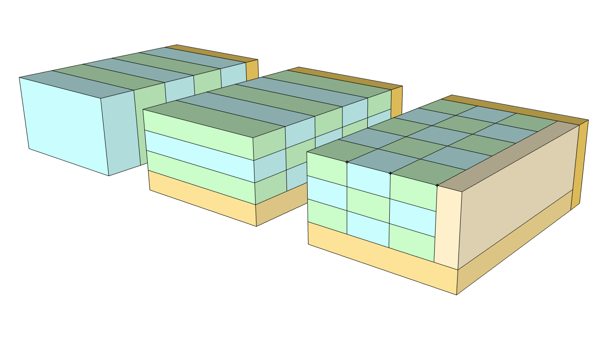

```{r  ring light-run data, include=FALSE}
setwd("~/Pubblici/learn-git/ring/ring-light-run")
mat <- array(data = 0, dim = c(96,4))
colnames(mat) <- c('node','numproc','exec-time','init-time')
row <- 1
for (i in 1:4){
  for (j in 1:24){
    num <- i*j
    tab <- read.csv(paste("./ring-node-",i,"-core-",num,"/summary.csv", sep = ''))
    mat[row, 1] <- i
    mat[row, 2] <- num
    mat[row, 3] <- mean(tab[,2])
    mat[row, 4] <- mean(tab[,3])
    row <- row + 1
  }
}
mat <- data.frame(mat)
mat$node <- as.factor(mat$node)
```

## R Markdown

This is an R Markdown document. Markdown is a simple formatting syntax for authoring HTML, PDF, and MS Word documents. For more details on using R Markdown see <http://rmarkdown.rstudio.com>.

When you click the **Knit** button a document will be generated that includes both content as well as the output of any embedded R code chunks within the document. You can embed an R code chunk like this:

## Including Plots

You can also embed plots, for example:

```{r ring light-run plot,echo=FALSE}
library(ggplot2)
block_start <- 1 + 24 * 0
block_end <- 24 * 4
ggplot(data = mat[block_start:block_end,],mapping = aes(x = numproc, y = exec.time, color = node)) +
  geom_line()+
  geom_point()+
  labs(title = "Light  run ring",
       caption = "1'000 for all combination of  nodes")
```

```{r ring heavy-run data, include=FALSE}
setwd("~/Pubblici/learn-git/ring/nested-file-bash")
mat <- array(data = 0, dim = c(96,4))
colnames(mat) <- c('node','numproc','exec-time','init-time')
row <- 1
for (i in 1:4){
  for (j in 1:24){
    num <- i*j
    tab <- read.csv(paste("./ring-node-",i,"-core-",num,"/summary.csv", sep = ''))
    mat[row, 1] <- i
    mat[row, 2] <- num
    mat[row, 3] <- mean(tab[,2])
    mat[row, 4] <- mean(tab[,3])
    row <- row + 1
  }
}
mat <- data.frame(mat)
mat$node <- as.factor(mat$node)
```

```{r ring heavy-run plot,echo=FALSE}
library(ggplot2)
block_start <- 1 + 24 * 0
block_end <- 24 * 4
ggplot(data = mat[block_start:block_end,],mapping = aes(x = numproc, y = exec.time, color = node)) +
  geom_point()+
  labs(title = "Heavy  run ring",
       caption = "10'000 repetions for the 1, 2 and 3 nodes, 1'000 for 4 nodes")
```
```{r ring really heavy-run data, echo=FALSE}
setwd("~/Pubblici/learn-git/ring/ring-heavy-run")
mat <- array(data = 0, dim = c(96,4))
colnames(mat) <- c('node','numproc','exec-time','init-time')
row <- 1
for (i in 1:4){
  for (j in 1:24){
    num <- i*j
    tab <- read.csv(paste("./ring-node-",i,"-core-",num,"/summary.csv", sep = ''))
    mat[row, 1] <- i
    mat[row, 2] <- num
    mat[row, 3] <- mean(tab[,2])
    mat[row, 4] <- mean(tab[,3])
    row <- row + 1
  }
}
mat <- data.frame(mat)
mat$node <- as.factor(mat$node)

library(ggplot2)
block_start <- 1 + 24 * 0
block_end <- 24 * 4
ggplot(data = mat[block_start:block_end,],mapping = aes(x = numproc, y = exec.time, color = node)) +
  geom_point()+
  labs(title = "Double ring",
       caption = "mean of 10 run with 100'000 repetions of one ring-round per run")
```

Note that the `echo = FALSE` parameter was added to the code chunk to prevent printing of the R code that generated the plot.
```{r decomposition of processes in grid,include=FALSE}
D_vec <- array(data = 0, dim = c(30,3))
# 1D decomposition
D_vec[1,1]=24 ; D_vec[1,2]=1; D_vec[1,3]=1
# 2D decomposition
D_vec[2,1]=12; D_vec[2,2]=2; D_vec[2,3]=1
D_vec[3,1]=2; D_vec[3,2]=12; D_vec[3,3]=1
D_vec[4,1]=6; D_vec[4,2]=4; D_vec[4,3]=1
D_vec[5,1]=4; D_vec[5,2]=6; D_vec[5,3]=1
D_vec[6,1]=3; D_vec[6,2]=8; D_vec[6,3]=1
D_vec[7,1]=8; D_vec[7,2]=3; D_vec[7,3]=1
# 3D decomposition
D_vec[8,1]=2; D_vec[8,2]=2; D_vec[8,3]=6
D_vec[9,1]=2; D_vec[9,2]=6; D_vec[9,3]=2
D_vec[10,1]=6; D_vec[10,2]=2; D_vec[10,3]=2
D_vec[11,1]=4; D_vec[11,2]=2; D_vec[11,3]=3
D_vec[12,1]=4; D_vec[12,2]=3; D_vec[12,3]=2
D_vec[13,1]=2; D_vec[13,2]=4; D_vec[13,3]=3
D_vec[14,1]=2; D_vec[14,2]=3; D_vec[14,3]=4
D_vec[15,1]=3; D_vec[15,2]=4; D_vec[15,3]=2
D_vec[16,1]=3; D_vec[16,2]=2; D_vec[16,3]=4
# 1D decomposition, remaining subdivision
D_vec[17,1]=1 ; D_vec[17,2]=24; D_vec[17,3]=1
D_vec[18,1]=1 ; D_vec[18,2]=1; D_vec[18,3]=24
# 2D decomposition, remaining subdivision
D_vec[19,1]=1;  D_vec[19,2]=2;  D_vec[19,3]=12
D_vec[20,1]=1;  D_vec[20,2]=12; D_vec[20,3]=2 
D_vec[21,1]=1;  D_vec[21,2]=4;  D_vec[21,3]=6 
D_vec[22,1]=1;  D_vec[22,2]=6;  D_vec[22,3]=4 
D_vec[23,1]=1;  D_vec[23,2]=8;  D_vec[23,3]=3 
D_vec[24,1]=1;  D_vec[24,2]=3;  D_vec[24,3]=8 

D_vec[25,1]=12; D_vec[25,2]=1;  D_vec[25,3]=2 
D_vec[26,1]=2;  D_vec[26,2]=1;  D_vec[26,3]=12
D_vec[27,1]=6;  D_vec[27,2]=1;  D_vec[27,3]=4
D_vec[28,1]=4;  D_vec[28,2]=1;  D_vec[28,3]=6
D_vec[29,1]=3;  D_vec[29,2]=1;  D_vec[29,3]=8
D_vec[30,1]=8;  D_vec[30,2]=1;  D_vec[30,3]=3
```


```{r matrix-addition data, include=FALSE}
setwd("~/Pubblici/learn-git/matrix")
mat.add <- array(data = 0, dim = c(310,8))
colnames(mat.add) <- c('decom','topo','matrix',
                   'pre.send','main.matrix',
                   'remain.matrix','total.comput','total')
which.row <- 1
topo.row <- 1
while (which.row <= 300){
  uno <- D_vec[topo.row,1]
  due <- D_vec[topo.row,2]
  tre <- D_vec[topo.row,3]
  topo.row <- topo.row + 1
  folder <- paste('matrix-',uno,'-',due,'-',tre, sep='')
  for (i in 0:9){
    subfolder <- paste('./',folder,'/matrix-',i,sep='')
    tab.add <- read.csv(paste(subfolder,'/summary.csv', sep = ''))
    if ((tre == 1 && due == 1)) {
      mat.add[which.row, 1] <- '1D-x-1-1'
    } else if((tre==1 && uno==1) ){
      mat.add[which.row, 1] <- '1D-1-x-1'
    } else if (due == 1 && uno == 1){
      mat.add[which.row, 1] <- '1D-1-1-x'
    } else if (tre == 1){
      mat.add[which.row, 1] <- '2D-x-x-1'
    } else if (due == 1){
      mat.add[which.row, 1] <- '2D-x-1-x'
    } else if (uno == 1){
      mat.add[which.row, 1] <- '2D-1-x-x'
    } 
    else{
      mat.add[which.row, 1] <- '3D'
    }
    if (i == 0){mat.add[which.row, 3] <- '2400x100x100'} 
    else if (i == 1){ mat.add[which.row, 3] <- '1200x200x100'}
    else if (i== 2) { mat.add[which.row, 3] <- '800x300x100' }
    else if (i== 3) { mat.add[which.row, 3] <- '100x100x2400'}
    else if (i== 4) { mat.add[which.row, 3] <- '100x200x1200'}
    else if (i== 5) { mat.add[which.row, 3] <- '100x300x800' }
    else if (i== 6) { mat.add[which.row, 3] <- '300x400x200'}
    else if (i== 7) { mat.add[which.row, 3] <- '200x1200x100'}
    else if (i== 8) { mat.add[which.row, 3] <- '100x100x2400' }
    else if (i== 9) { mat.add[which.row, 3] <- '100x1200x200' }
    mat.add[which.row, 2] <- folder
    mat.add[which.row, 4] <- mean(tab.add[,1])
    mat.add[which.row, 5] <- mean(tab.add[,2])
    mat.add[which.row, 6] <- mean(tab.add[,3])
    mat.add[which.row, 7] <- mean(tab.add[,4])
    mat.add[which.row, 8] <- mean(tab.add[,5])
    which.row <- which.row + 1
  }
}
folder <- 'matrix-check'
for (i in 0:9){
  subfolder <- paste('./',folder,'/matrix-',i,sep='')
  tab.add <- read.csv(paste(subfolder,'/summary.csv', sep = ''))
  mat.add[which.row, 1] <- 'check'
  if (i == 0){mat.add[which.row, 3] <- '2400x100x100'} 
  else if (i == 1){ mat.add[which.row, 3] <- '1200x200x100'}
  else if (i== 2) { mat.add[which.row, 3] <- '800x300x100' }
  else if (i== 3) { mat.add[which.row, 3] <- '100x100x2400'}
  else if (i== 4) { mat.add[which.row, 3] <- '100x200x1200'}
  else if (i== 5) { mat.add[which.row, 3] <- '100x300x800' }
  else if (i== 6) { mat.add[which.row, 3] <- '300x400x200'}
  else if (i== 7) { mat.add[which.row, 3] <- '200x1200x100'}
  else if (i== 8) { mat.add[which.row, 3] <- '100x100x2400' }
  else if (i== 9) { mat.add[which.row, 3] <- '100x1200x200' }
  mat.add[which.row, 2] <- 'matrix-check'
  mat.add[which.row, 4] <- mean(tab.add[,1])
  mat.add[which.row, 5] <- mean(tab.add[,2])
  mat.add[which.row, 6] <- 0
  mat.add[which.row, 7] <- mean(tab.add[,2])
  mat.add[which.row, 8] <- mean(tab.add[,3])
  which.row <- which.row + 1
}

mat.add <- data.frame(mat.add)
mat.add$pre.send <- as.numeric(mat.add$pre.send)
mat.add$main.matrix <- as.numeric(mat.add$main.matrix)
mat.add$remain.matrix <- as.numeric(mat.add$remain.matrix)
mat.add$total.comput <- as.numeric(mat.add$total.comput)
mat.add$total <- as.numeric(mat.add$total)

```


```{r matrix-addition plot per Dim-Decom, echo=FALSE}
library(ggplot2)
ggplot(data = mat.add) +
  geom_boxplot(mapping = aes(x = decom, y = pre.send , color = matrix))
ggplot(data = mat.add) +
  geom_boxplot(mapping = aes(x = decom, y = main.matrix , color = matrix))
ggplot(data = mat.add)+
  geom_boxplot(mapping = aes(x = decom, y = remain.matrix , color = matrix))
ggplot(data = mat.add)+
  geom_boxplot(mapping = aes(x = decom, y = total.comput , color = matrix))
ggplot(data = mat.add)+
  geom_boxplot(mapping = aes(x = decom, y = total , color = matrix))
```

```{r, echo=FALSE}
library(ggplot2)
library(gridExtra)

tota.pre <- ggplot(data = mat.add) + coord_flip() +
  geom_boxplot(mapping = aes(x = decom, y = pre.send ))
tota.mai <- ggplot(data = mat.add)+ coord_flip() +
  geom_boxplot(mapping = aes(x = decom, y = main.matrix ))
tota.rem <- ggplot(data = mat.add)+ coord_flip() +
  geom_boxplot(mapping = aes(x = decom, y = remain.matrix ))
tota.tcom <- ggplot(data = mat.add)+ coord_flip() +
  geom_boxplot(mapping = aes(x = decom, y = total.comput ))
tota.tot <- ggplot(data = mat.add)+ coord_flip() +
  geom_boxplot(mapping = aes(x = decom, y = total ))
grid.arrange( tota.pre,
              tota.mai,
              tota.rem,
              tota.tcom,
              tota.tot,
              nrow = 2, ncol = 3)
```
```{r, echo=FALSE}
library(ggplot2)
library(gridExtra)

dec.2d.1 <- ggplot(data = mat.add[mat.add$decom == "2D-1-x-x",]) + labs(title = "2D-1-x-x" ) +
  geom_boxplot(mapping = aes(x = total, y = topo ))
dec.2d.2 <- ggplot(data = mat.add[mat.add$decom == "2D-x-1-x",]) + labs(title = "2D-x-1-x" )+
  geom_boxplot(mapping = aes(x = total, y = topo ))
dec.2d.3 <- ggplot(data = mat.add[mat.add$decom == "2D-x-x-1",]) + labs(title = "2D-x-x-1" )+
  geom_boxplot(mapping = aes(x = total, y = topo ))
dec.3d.1 <- ggplot(data = mat.add[mat.add$decom == "3D",]) + labs(title = "3D" ) +
  geom_boxplot(mapping = aes(x = total, y = topo ))
grid.arrange( dec.2d.1,
              dec.2d.2,
              dec.2d.3,
              dec.3d.1,
              nrow = 2, ncol = 2)
```
```{r, echo = FALSE}
library(ggplot2)
ggplot(data = mat.add) +
  coord_flip()+
  geom_boxplot(mapping = aes(x = matrix, y = pre.send , color = decom))
ggplot(data = mat.add) +
  coord_flip()+
  geom_boxplot(mapping = aes(x = matrix, y = main.matrix , color = decom))
ggplot(data = mat.add) +
  coord_flip()+
  geom_boxplot(mapping = aes(x = matrix, y = total.comput , color = decom))
ggplot(data = mat.add) +
  coord_flip()+
  geom_boxplot(mapping = aes(x = matrix, y = total , color = decom))
```
```{r, include=FALSE}
library(ggplot2)
topol <- c('core', 'socket', 'node')
net <- c('gig', 'infin')
pml <- c('ob1', 'ucx')
btl <- c('vader','tcp' ,'openib')

ping.mpi <- array(data = 0, dim = c(840,8))
colnames(ping.mpi) <- c("topol","net","pml","btl","bytes","time","Mb.s","time.comp" )
how.row <- 1

howmany <- 100 
iter <- howmany -1
for  ( to in topol ){
  for (ne in net ){
    for (pm in pml ){
      for (bt in btl ){
        if (((pm=='ob1')&&(bt=='openib'))||
            ((to=='node')&&(pm=='ob1')&&(bt=='vader'))){ next 
        }else{
          setwd(paste("~/Pubblici/learn-git/data_col_mpi/topo-",
                      to,"/net-",ne,"/pml-",pm,"/btl-",bt,sep=''))
          mat <- array(data = 0, dim = c(howmany,30,2))
          y.dat <- c()
          x.dat <- c()
          z.dat <- c()
          for (y in 0:iter){
            tab <- read.csv(paste('results-',y,'.csv', sep = ''))
            mat[y+1,,1] <- tab[,3]
            mat[y+1,,2] <- tab[,4]
            y.dat <- c(y.dat, tab[,3])
            x.dat <- c(x.dat, tab[,1])
            z.dat <- c(z.dat, tab[,4])
          }
          modello <- nls(y.dat~ a + x.dat/b, start = list (a=2, b = 12000))
          latency <- coef(modello)[1]
          bandwidth <- coef(modello)[2]
          
          mat.mean <- matrix(data = 0, nrow = 30, ncol = 2)
          mat.var <- matrix(data = 0, nrow = 30, ncol = 2)
          for (y in 1:30){
            mat.mean[y,1] <- mean(mat[,y,1])
            mat.mean[y,2] <- mean(mat[,y,2])
            mat.var[y,1] <- var(mat[,y,1])
            mat.var[y,2] <- var(mat[,y,2])
            tab[y,5] <- latency + tab[y,1]/bandwidth
            tab[y,6] <- tab[y,1]/tab[y,5]
            
            ping.mpi[how.row, 1] <- to
            ping.mpi[how.row, 2] <- ne
            ping.mpi[how.row, 3] <- pm
            ping.mpi[how.row, 4] <- bt
            ping.mpi[how.row, 5] <- tab[y,1] # number of bytes
            ping.mpi[how.row, 6] <- tab[y,3] # mean time
            ping.mpi[how.row, 7] <- tab[y,4] # Mb per second
            ping.mpi[how.row, 8] <- tab[y,5] # computed time
            how.row <- how.row + 1
          }
          tab[,3] <- mat.mean[,1]
          tab[,4] <- mat.mean[,2]
          
          write.csv2(round(tab,digits = 2), 
                     file = paste('~/Pubblici/learn-git/data_col_mpi/summary--topo-',to,
                                  "--net-",ne,
                                  "--pml-",pm,
                                  "--btl-",bt,'.csv',sep=''),
                     quote = FALSE ,row.names = FALSE)

        }
      }
    }
  }
}
ping.mpi <- data.frame(ping.mpi)
ping.mpi$bytes <- as.numeric(ping.mpi$bytes)
ping.mpi$time <- as.numeric(ping.mpi$time)
ping.mpi$Mb.s <- as.numeric(ping.mpi$Mb.s)
ping.mpi$time.comp <- as.numeric(ping.mpi$time.comp)
```

```{r,echo=FALSE,warning=FALSE}
library(ggplot2)
ggplot(data = ping.mpi, mapping = aes(x = bytes, y = Mb.s, color = topol ))+
  geom_point()+
  scale_x_continuous(trans='log2')
ggplot(data = ping.mpi[ping.mpi$topol == 'node',],
       mapping = aes(x = bytes, y = Mb.s, color = interaction(net,pml,sep='-')) )+
    labs(color = "pml-btl")+
  geom_point()+
  scale_x_continuous(trans='log2')
ggplot(data = ping.mpi[ping.mpi$topol == 'socket',],
       mapping = aes(x = bytes, y = Mb.s, color = interaction(pml,btl,sep='-')) )+
    labs(color = "pml-btl")+
  geom_point()+
  scale_x_continuous(trans='log2')
ggplot(data = ping.mpi[ping.mpi$topol == 'core',],
       mapping = aes(x = bytes, y = Mb.s, color = interaction(pml,btl,sep='-')) )+
  labs(color = "pml-btl")+
  geom_point()+
  scale_x_continuous(trans='log2')
ggplot(data = ping.mpi[ping.mpi$topol == 'core',],
       mapping = aes(x = bytes, y = Mb.s, color = net) )+
  geom_point()+
  scale_x_continuous(trans='log2')
```
```{r pressure, echo=FALSE, fig.cap="A caption", out.width = '100%'}

```


```{r jacobi data, include=FALSE}
setwd('~/Pubblici/learn-git/jacobi/test-data')
topol <- c('core', 'socket')
num_proc <- c(4,8,12)
num_deco <- c(6,10,18)
howmany <- 10
for ( i in 1:2 ){
  top <- topol[i]
  for ( j in 1:3 ){
    proc <- num_proc[j]
    deco <- num_deco[j]
    for ( d in 0:(deco-1) ){
      for (k in 0:(howmany-1)){
        tab.jac <- read.csv(paste("./jacobi-",proc,"-",top,
                                  "/deco-",d,"/output-time-",k,".csv",sep = ''))
        tab.jac$X9 <- as.numeric(tab.jac$X9)
        tab.jac$X10 <- as.numeric(tab.jac$X10)
        tab.jac$X14 <- as.numeric(tab.jac$X14)
        time <- c()
        time <- c(time, mean(tab.jac[,9]))
        time <- c(time, mean(tab.jac[,10]))
        time <- mean(time)
        MPLUPs <- mean(tab.jac$X14)
        }
    }
  }
}

```

